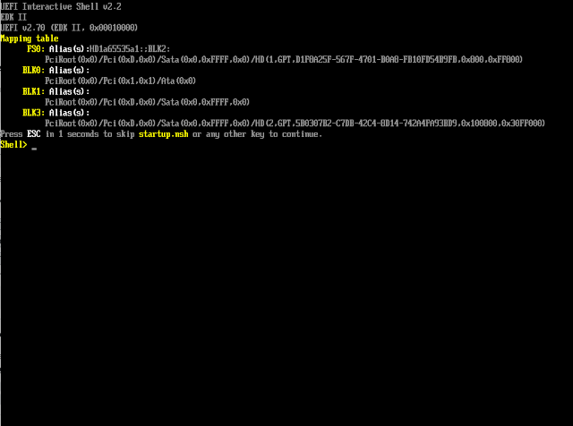
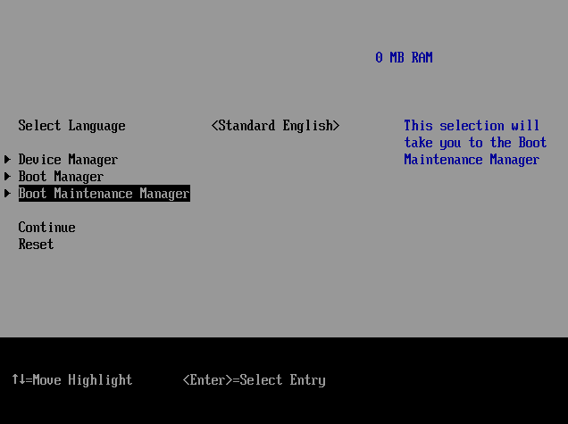
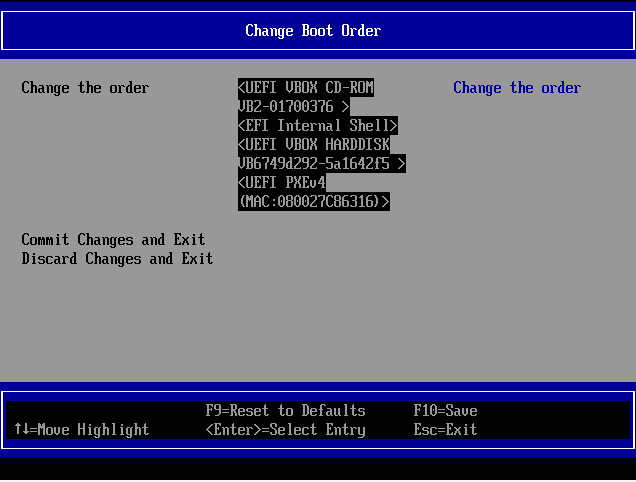
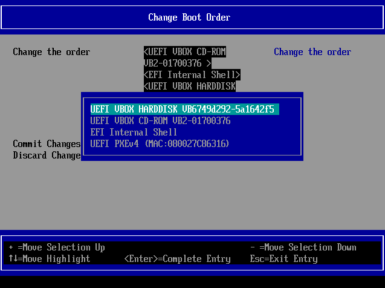

# COMMANDS
Here are some commands that differs from APT and Ubuntu-based distros.

<br>

## UPDATE REPOSITORIES AND UPGRADE

```bash
sudo pacman -Syyu
```

<br>

## CLEAR PACMAN CACHE

```bash
sudo pacman -Scc
```

<br>

## CLEAR PACMAN CACHE

```bash
sudo pacman -Scc
```

<br>

## CHECK THE MIME TYPE

Run the following command in terminal
```bash
xdg-mime query filetype <file-path>
```

<br>

## UPDATE GRUB

Run the following command in terminal
```bash
grub-mkconfig -o /boot/grub/grub.cfg
```

<br>

## RUN APPLICATION AS ROOT (OR OTHER USER) USING POLKIT DIALOG TO ASK FOR PASSWORD

Run the following command in terminal
```bash
pkexec env DISPLAY=$DISPLAY XAUTHORITY=$XAUTHORITY <application-name>
```

<br>

## DISABLE YAY FROM ASKING ON INSTALLATION

Run the following command in terminal
```bash
yay --answerdiff None --answerclean All --removemake -S <package-name>
```

## MOUNT VIA TERMINAL

Check which device you want to mount
```bash
blkid
```

Mount it
```bash
mount /dev/<id> /mnt
```
<br>

## LAUNCH HEADLESS VIRTUALBOX VM AND REMOVE THE HEADLESS LOGS

```bash
exec vboxmanage startvm "<vm-name>" --type=headless &
find . -maxdepth 1 -name "*VBoxHeadless*" -delete &
```
<br>

## ACTIVATING NUMLOCK ON BOOTUP

* Open the file `~/.config/xfce4/xfconf/xfce-perchannel-xml/keyboards.xml`
* Add the following properties to the `keyboars` channel
  ```xml
  <property name="Numlock" type="bool" value="true"/>
  <property name="RestoreNumlock" type="bool" value="true"/>
  ```
  
  **Like this**
  ```xml
  <?xml version="1.0" encoding="UTF-8"?>

  <channel name="keyboards" version="1.0">
    <property name="Default" type="empty">
      <property name="Numlock" type="bool" value="true"/>
      <property name="RestoreNumlock" type="bool" value="true"/>
    </property>
  </channel>
  ```
* Save and close and reboot.

## FLICKERING ISSUES

* Edit the file `~/.config/picom.conf`
* Search for `use-damage` and set it to `false`
* Save and close. No need  to reboot or logout/login

<br>

## PASSWORD FEEDBACK WHEN SUDO

* Run `sudo EDITOR=nano visudo`
* Search for a `Defaults` without a `#` in front of it.
  > If there is no `Defaults` uncommented, just add a new line and type `Defaults`
* Add a new value `pwfeedback` in front of it. It may look something like this
  ```config
  Defaults env_reset, pwfeedback
  ```
  Or
  ```config
  Defaults pwfeedback
  ```
* Save and close.

<br>

## VSCODE SYNC RETURNING ERROR

After login on Github with VSCode to sync settings, VSCode returns the following error

> Writing login information to the keychain failed with error 'GDBus.Error:org.freedesktop.DBus.Error.ServiceUnknown: The name org.freedesktop.secrets was not provided by any .service files'.

* Install Gnome Keyring:
  ```bash
  sudo pacman -S gnome-keyring 
  ```
  
* Try sync again
  > **NOTE: If it asks for to create a password, leave it in blank and confirm.**

<br>

## MOUSE CURSOR THEMES NOT PERSISTING

* Delete this file `~/.icons/default/index.theme`
* Open **LxAppearance** and choose the theme you want and click on **__Apply__**.<br>
  > **Note:** You can open LXAppearance running `lxappearance` in the terminal
* Now open **XFCE Settings Manager**<br>
  > **Note:** You can open XFCE Settings Manager running `xfce4-settings-manager` in the terminal
* There, select **Mouse and touchpad**
* Select the *Theme* tab and choose the same theme you selected in the LxAppearance.
* Close everything and reboot.

<br>

## DISCORD HAS AN UPDATE THAT ISN'T AVAILABLE IN THE REPOSITORY

* Trick the application by editing the `build_info.json` file. Run:
  ```bash
  sudo nano /opt/discord/resources/build_info.json
  ```
* Change the version to the most recent
* Save, close and reopen Discord

> **NOTE:** When an update are available, this file will also be updated, so don't worry.

<br>

## FREE FILE SYNC NOT RESPONDING

Move the window and see if there is an *About* window under that. That window prevents you from interacting with the program.

<br>

## MISSING SOME CHARACTERS

Run the following command in terminal
```bash
sudo pacman -S noto-fonts-cjk noto-fonts-emoji noto-fonts
```

<br>

## WORKAROUND FOR WEIRD SHADOW AT MENUS

Some shadows are shown glitchy and weird, like in Firefox or VLC, like this:
<br>


The only way I found to make it less annoying is by removing the shadow from these types of menus.

* Open Kvantum
* Choose to disable composite effects
  
<br>

* Open the file `~/.config/picom.conf`
* Locate the array `shadow-exclude`
* Add these keys and values to the array:
  ```
  "class_g = 'firefox' && window_type = 'menu'",
  "class_g = 'firefox' && window_type = 'dropdown_menu'",
  "class_g = 'firefox' && window_type = 'popup_menu'",
  "class_g = 'firefox' && window_type = 'tooltip'",
  "class_g = 'xdg-desktop-portal-gnome' && window_type = 'menu'",
  "class_g = 'baobab' && window_type = 'menu'",
  "class_g = 'gnome-font-viewer' && window_type = 'menu'",
  "_NET_WM_WINDOW_TYPE:a *= '_KDE_NET_WM_WINDOW_TYPE_OVERRIDE'",
  ```
* Save and close.

**Result**
<br>


<br>

## OBS WITH WRONG OR WEIRD THEME

* Open Kvantum
* Choose Application themes
* Choose the KvFlat theme and write `obs` in the field<br>
  <br><br>
* Click save, close and then reopen OBS.

<br>

## PERMISSION DENIED FOR SHARED FOLDERS ON VIRTUAL BOX

On the guest side, run the following command
```bash
sudo usermod -aG vboxsf $USER
```

Reboot the guest side

<br>

## CHANGING THE DEFAULT SHELL

1. Check the available shells run:
    ```bash
    cat /etc/shells
    ```

1. It will return the available shell binaries, like this:

    ```
    # Pathnames of valid login shells.
    # See shells(5) for details.

    /bin/sh
    /bin/bash
    /usr/bin/git-shell
    /usr/bin/fish
    /bin/fish
    ```

1. Run the following command, informing the shell you want as default.
    ```bash
    chsh -s <shell> $USER

    # Example
    # chsh -s /bin/fish $USER
    ```

1. Inform you password.<br />
    The change will affect the current user only.

<br>

## TROUBLE WITH SYSTEM NOT BOOTING UP ON VIRTUAL BOX

If it shows the UEFI Shell instead of GRUB, it can be a problem with BOOT ORDER from BIOS of the VM.



---

1. Run the VM and press F2 to enter the BIOS. You need to be really fast. A tip is to press Host()Left Ctrl)+R while hitting F2 multiple times.<br /><br />
    You will see an screen like this:<br />
    

1. Now, choose **Boot Maintenance Manager > Boot Options > Change Boot Order**.<br /><br />
    You will see an screen like this.<br />
    

1. Press ENTER and use the `+` or `-` keys to change the boot order. You need to set the hard drive that have the UFI partition.<br /><br />
    

1. Press ENTER and F10 to save the changes.
1. Press ESC until you reach the first screen and choose **Reset** to reboot the VM.
