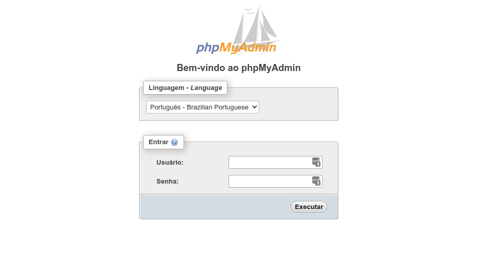

# 3. INSTALANDO MYSQL
Banco de Dados SQL.

<br>

## INSTALANDO MYSQL
Execute os seguintes comandos:

```bash
sudo apt install mysql-server;
sudo systemctl enable mysql.service;
sudo systemctl start mysql.service;
```

<br>

## INSTALANDO O PHPMYADMIN
Execute o seguinte comando:

```bash
sudo apt-get install phpmyadmin;
```

**NOTE**
- Ao instalar o `phpmyadmin`, ele pedirá para selecionar qual servidor será utilizado. Selecione **apache2**.
- A instalação do `phpmyadmin` perguntará se você deseja configurar o usuário **phpmyadmin**. Selecione **sim** e digite uma senha de sua escolha.

<br>

### Atualizando o PhpMyAdmin
Fonte: https://devanswers.co/manually-upgrade-phpmyadmin/

* O Ubuntu tem uma versão mais antiga do PhpMyAdmin. Vamos atualizá-la para a versão mais nova.

* Execute os seguintes comandos:
    ```bash
    sudo rm -rf /usr/share/phpmyadmin.bak;
    sudo mv /usr/share/phpmyadmin/ /usr/share/phpmyadmin.bak;
    sudo mkdir /usr/share/phpmyadmin/;
    cd /usr/share/phpmyadmin/;
    sudo wget https://files.phpmyadmin.net/phpMyAdmin/5.2.0/phpMyAdmin-5.2.0-all-languages.tar.gz;
    sudo tar xzf phpMyAdmin-5.2.0-all-languages.tar.gz;
    sudo mv phpMyAdmin-5.2.0-all-languages/* /usr/share/phpmyadmin;
    ```

* Agora precisamos configurar algumas coisas, pois o PhpMyAdmin pode retornar alguns erros ao fazer login.
    * Execute o seguinte comando:
        ```bash
        sudo nano /usr/share/phpmyadmin/config.inc.php;
        ```
    * Cole o seguinte código. Se o conteúdo já existir, vá para o próximo passo.
        ```php
        <?php
            $cfg['blowfish_secret'] = '<BLOWFISH SECRET HERE>';
        ```
    * Abra este site para gerar um segredo blowfish.
      https://passgen.co/?pw=32&a=1
    * Copie o código.
    * Substitua a parte `<BLOWFISH SECRET HERE>` pelo código blowfish copiado.
    * Pressione `CTRL+S` para salvar e `CTRL+X` para sair.
    * Execute o seguinte comando:
        ```bash
        sudo mkdir /usr/share/phpmyadmin/tmp;
        sudo chmod 777 /usr/share/phpmyadmin/tmp;
        ```
* Teste e verifique se está funcionando. Se sim, execute os seguintes comandos para limpar arquivos desnecessários:
    ```bash
    sudo rm /usr/share/phpmyadmin/phpMyAdmin-5.2.0-all-languages.tar.gz;
    sudo rm -rf /usr/share/phpmyadmin/phpMyAdmin-5.2.0-all-languages;
    sudo rm -rf /usr/share/phpmyadmin.bak;
    cd $HOME;
    ```

<br>

## CONFIGURANDO A SENHA ROOT DO MYSQL
Execute os seguintes comandos:

```bash
sudo cp -rp "/var/run/mysqld" "/var/run/mysqld.bak";
sudo service mysql stop;
sudo mv "/var/run/mysqld.bak" "/var/run/mysqld";
sudo mysqld_safe --skip-grant-tables --skip-networking &
```

**NOTA**
- Pressione `ENTER` se o terminal parecer travar.

Agora, precisamos adicionar uma senha ao usuário root e conceder permissões ao usuário do phpmyadmin.

<br>

> **ATENÇÃO!**
> ANTES DE EXECUTAR O COMANDO ABAIXO, EDITE-O TROCANDO O `<ROOT_PASSWORD_HERE>` POR UMA SENHA FORTE E APROPRIADA!
> 

**NOTA:**
- Se o MySQL pedir uma senha, apenas pressione `ENTER`.

```bash
mysql -p -u root -e "USE mysql; FLUSH PRIVILEGES; ALTER USER 'root'@'localhost' IDENTIFIED WITH mysql_native_password BY '<ROOT_PASSWORD_HERE>'; FLUSH PRIVILEGES; GRANT ALL PRIVILEGES ON *.* TO 'phpmyadmin'@'localhost' WITH GRANT OPTION; FLUSH PRIVILEGES;";
```

## CONFIGURANDO O PHPMYADMIN


### Criando um Novo Virtual Host
Execute o seguinte comando:

<br>

```bash
sudo nano /etc/apache2/sites-available/phpmyadmin.conf
```

<br>

Agora, cole as seguintes configurações dentro deste novo arquivo:

<br>

 ```apache
<VirtualHost *:80>
    ServerName phpmyadmin.mydomain.com
    ServerAlias phpmyadmin.mydomain.com

    DocumentRoot "/usr/share/phpmyadmin"

    <Directory "/usr/share/phpmyadmin">
            AllowOverride All
    </Directory>

    Include /etc/apache2/conf-available/php7.4-fpm.conf
</VirtualHost>
```

**NOTAS:**
 - Você **precisa** alterar o `ServerName` e `ServerAlias` para um subdomínio de sua preferência.
 - Eu usei o PHP 7.4 para rodar este virtual host porque o phpMyAdmin pode ter problemas com o PHP 8.0. De qualquer forma, teste, pode ser que tenha havido alguma atualização.

<br>

Salve o arquivo e depois saia.

<br>

### Habilitando o Virtual Host

```bash
sudo a2ensite phpmyadmin
```

<br>

### Reinicie o Apache

```bash
sudo service apache2 restart
```

<br>

### Teste
Verifique se o subdomínio que você configurou está funcionando.



<br><br>
<div>
    <table width="9000">
        <!-- <tr>
            <td width="9000"></td>
            <td width="50%" align="right"><a href=""><b></b></a></td>
        </tr> -->
        <tr>
            <td width="9000" colspan="2" align="center">
                <a href="">
                    <b>Voltar à lista principal</b>
                </a>
            </td>
        </tr>
    </table>
</div>
