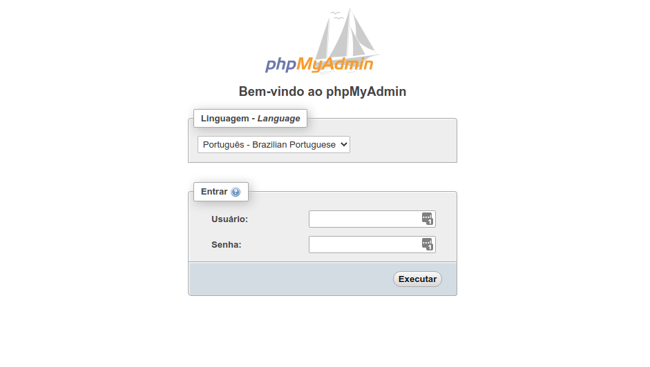

# 3. INSTALLING MYSQL
SQL Database.

<br>

## INSTALLING MYSQL
Execute the following commands:

```bash
sudo apt install mysql-server;
sudo systemctl enable mysql.service;
sudo systemctl start mysql.service;
```

<br>

## INSTALLING PHPMYADMIN
Execute the following command:

```bash
sudo apt-get install phpmyadmin;
```

**NOTE**
- When installing `phpmyadmin`, it will ask to select which server would be used. Select **apache2**.
- `phpmyadmin` installation will ask if you want to configure the *phpmyadmin* user. Select **yes** and type a password of your choice.

<br>

### Updating PhpMyAdmin
Source: https://devanswers.co/manually-upgrade-phpmyadmin/

* Ubuntu has an older version of PhpMyAdmin. Lets update it to the newer version.

* Run the following commands:
    ```bash
    sudo rm -rf /usr/share/phpmyadmin.bak;
    sudo mv /usr/share/phpmyadmin/ /usr/share/phpmyadmin.bak;
    sudo mkdir /usr/share/phpmyadmin/;
    cd /usr/share/phpmyadmin/;
    sudo wget https://files.phpmyadmin.net/phpMyAdmin/5.2.0/phpMyAdmin-5.2.0-all-languages.tar.gz;
    sudo tar xzf phpMyAdmin-5.2.0-all-languages.tar.gz;
    sudo mv phpMyAdmin-5.2.0-all-languages/* /usr/share/phpmyadmin;
    ```

* Now we need to configure some stuff because PhpMyAdmin will return some errors when you login.
    * Run the following command:
        ```bash
        sudo nano /usr/share/phpmyadmin/config.inc.php;
        ```
    * Paste the following script. If the content already exists, just go to the next step.
        ```php
        <?php
            $cfg['blowfish_secret'] = '<BLOWFISH SECRET HERE>';
        ```
    * Open this website to generate a blowfish secret.\
    https://passgen.co/?pw=32&a=1
    * Copy the code.
    * Replace the `<BLOWFISH SECRET HERE>` part to the blowfish code you copied.
    * Press `CTRL+S` to save and `CTRL+X` to close.
    * Run the following command:
        ```bash
        sudo mkdir /usr/share/phpmyadmin/tmp;
        sudo chmod 777 /usr/share/phpmyadmin/tmp;
        ```
* Test it and check if it is working. If so, run the following commands to cleanup unnecessary files:
    ```bash
    sudo rm /usr/share/phpmyadmin/phpMyAdmin-5.2.0-all-languages.tar.gz;
    sudo rm -rf /usr/share/phpmyadmin/phpMyAdmin-5.2.0-all-languages;
    sudo rm -rf /usr/share/phpmyadmin.bak;
    cd $HOME;
    ```

<br>

## CONFIGURING MYSQL ROOT PASSWORD
Execute the following command:

```bash
sudo cp -rp "/var/run/mysqld" "/var/run/mysqld.bak";
sudo service mysql stop;
sudo mv "/var/run/mysqld.bak" "/var/run/mysqld";
sudo mysqld_safe --skip-grant-tables --skip-networking &
```

**NOTE**
- Press `ENTER` if the terminal seems to freeze.

Next we need to add a password to the root user and give root permission to the phpmyadmin user.

<br>

> **ATTENTION!**
> BEFORE EXECUTE TO FOLLOWING COMMAND, EDIT IT CHANGING THE `<ROOT_PASSWORD_HERE>` ENTERING A PROPER AND STRONG PASSWORD!
> 

**NOTE:**
- If MySQL asks for a password, just hit `ENTER`.

```bash
mysql -p -u root -e "USE mysql; FLUSH PRIVILEGES; ALTER USER 'root'@'localhost' IDENTIFIED WITH mysql_native_password BY '<ROOT_PASSWORD_HERE>'; FLUSH PRIVILEGES; GRANT ALL PRIVILEGES ON *.* TO 'phpmyadmin'@'localhost' WITH GRANT OPTION; FLUSH PRIVILEGES;";
```

## CONFIGURING PHPMYADMINH


### Create A New Virtual Host
Execute the following commands:

<br>

```bash
sudo nano /etc/apache2/sites-available/phpmyadmin.conf
```

<br>

Now, paste the following configurations inside this new file

<br>

 ```apache
<VirtualHost *:80>
    ServerName phpmyadmin.mydomain.com
    ServerAlias phpmyadmin.mydomain.com

    DocumentRoot "/usr/share/phpmyadmin"

    <Directory "/usr/share/phpmyadmin">
            AllowOverride All
    </Directory>

    Include /etc/apache2/conf-available/php7.4-fpm.conf
</VirtualHost>
```

**NOTES:**
 - You **need** to change the `ServerName` and `ServerAlias` to a subdomain that you like.
 - I used the PHP 7.4 to run this virtual host because phpMyAdmin can have issues with PHP 8.0

<br>

Save the file pressing CTRL+O (CTRL+S can work too) and then exit Nano pressing CTRL+X.

<br>

### Enable the virtual host

```bash
sudo a2ensite phpmyadmin
```

<br>

### Restart Apache

```bash
sudo service apache2 restart
```

<br>

### Try it
Check if the subdomain you configured is working



<br><br>
<div>
    <table width="9000">
        <!-- <tr>
            <td width="9000"></td>
            <td width="50%" align="right"><a href=""><b></b></a></td>
        </tr> -->
        <tr>
            <td width="9000" colspan="2" align="center">
                <a href="">
                    <b>Return to the main list</b>
                </a>
            </td>
        </tr>
    </table>
</div>
