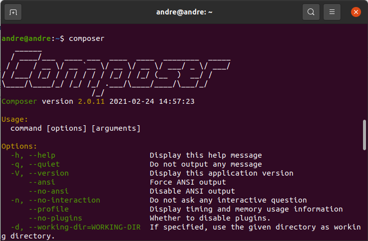

# 5. INSTALLING COMPOSER
PHP dependency manager.

<br>

Execute the following commands:

```bash
php -r "copy('https://getcomposer.org/installer', 'composer-setup.php');";
HASH="$(wget -q -O - https://composer.github.io/installer.sig)";
php -r "if (hash_file('SHA384', 'composer-setup.php') === '$HASH') { echo 'Installer verified'; } else { echo 'Installer corrupt'; unlink('composer-setup.php'); } echo PHP_EOL;";
sudo php composer-setup.php --install-dir=/usr/local/bin --filename=composer;
sudo rm composer-setup.php;
```

<br>

Test if it was installed
```bash
composer;
```

<br>
You will get a output like this




<br><br>
<div>
    <table width="9000">
        <!-- <tr>
            <td width="9000"></td>
            <td width="50%" align="right"><a href=""><b></b></a></td>
        </tr> -->
        <tr>
            <td width="9000" colspan="2" align="center">
                <a href="">
                    <b>Return to the main list</b>
                </a>
            </td>
        </tr>
    </table>
</div>
